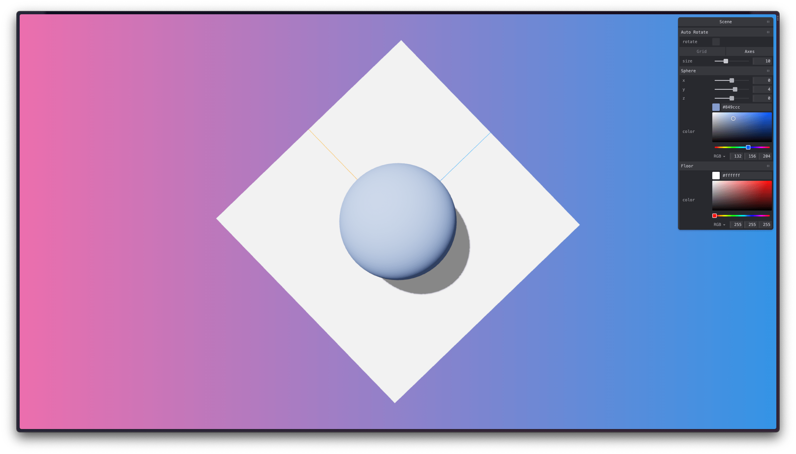

# Geometric Volume Shifter



## Demo

View a live demo of the [Geometric Volume Shifter](https:/svelte-geometric-volume-shifter.vercel.app).

## Tech Stack

- [TypeScript](https://www.typescriptlang.org/)
- [Three.JS](https://threejs.org/)
- [Threlte](https://threlte.xyz/)
- [Svelte](https://kit.svelte.dev/)
- [Vite](https://vitejs.dev/guide/)

## Creating a project

#### [Vite](https://kit.svelte.dev/docs/creating-a-project) Initialize

```
npm create svelte@latest Svelte_Geometric.Volume.Shifter

✅ Skeleton project
✅ TypeScript syntax
✅ ESLint for code linting
✅ Prettier for code formatting
```

#### Vite Configuration

```ts
// vite.config.ts

import { sveltekit } from '@sveltejs/kit/vite';
import type { UserConfig } from 'vite';

const config: UserConfig = {
	plugins: [sveltekit()],
	ssr: {
		noExternal: ['three', 'troika-three-text']
	}
};

export default config;
```

This configuration is to prevent `three` and `troika-three-text` dependencies from being externalized for server-side rendering by Vite

## Running Locally

1. Clone this repository :

```bash
> git clone git@github.com:GrungeElFz/Svelte_Geometric.Volume.Shifter.git

> cd Svelte_Geometric.Volume.Shifter

> code .

> npm i

> npm run dev
```

---

## Packages

### Threlte Packages

- `@threlte/core`
- `@threlte/extras`
- `@threlte/extras`

> Read more about [Threlte packages](https://threlte.xyz/getting-started#installation) and its requirements.

### Three.JS Package

- `three`

> Read more about [Three.JS](https://threejs.org/docs/manual/en/introduction/Installation.html) installation.

### Tweakpane

- `tweakpane`

> Read more about [Tweakpane](https://cocopon.github.io/tweakpane/getting-started/), a compact library for fine-tuning parameters and monitoring value changes.
